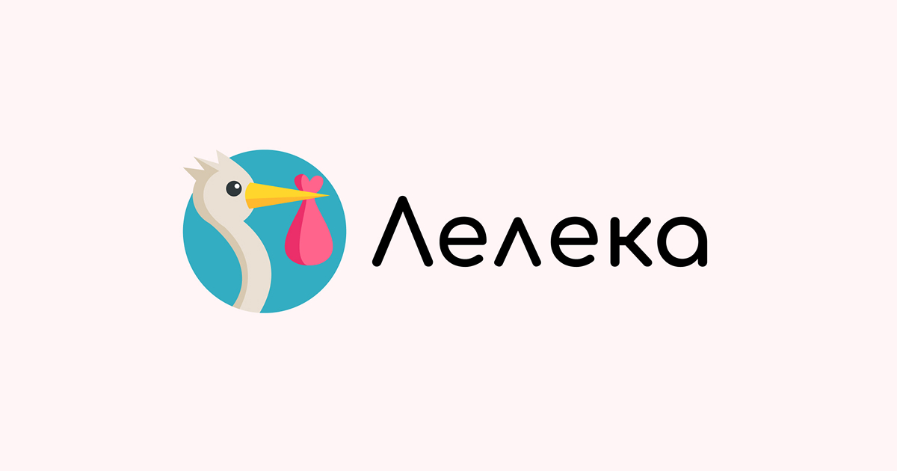

## 🤰 [Leleka Genesis (web application)](https://fullstack-genesis-project.vercel.app/)

<a href="https://fullstack-genesis-project.vercel.app/">
  
</a>

</br>
</br>

<table border="0" cellspacing="0" cellpadding="0" style="border-collapse: collapse;">
<tr>
<td width="75%" valign="top">

> A modern, responsive web application designed to support expectant mothers throughout their pregnancy journey.

**Pregnancy Tracker** provides a calm, intuitive, and personalized digital space where users can monitor pregnancy progress, manage daily tasks, record thoughts and moods, and receive relevant guidance — all across devices.

The application focuses on clarity, emotional comfort, and practical value, combining thoughtful UX with a scalable technical foundation.

</td>
<td width="25%" align="center">


</td>
</tr>
</table>

---

## 🛠️ Tech Stack

- **Next.js 15 (App Router)** — modern React-based architecture with server components and routing
- **TypeScript** — strong typing and improved code reliability
- **CSS Modules** — scoped, maintainable styling with a mobile-first approach
- **React Query (TanStack Query)** — data fetching, caching, and request synchronization
- **Zustand** — lightweight state management for shared UI and app state
- **Formik + Yup** — form handling with schema-based validation
- **Toast notifications** — user feedback for loading states, errors, and success events
- **Vercel** — frontend deployment and hosting
- **Node.js / Express / MongoDB** — backend API (maintained in a separate repository)

---

## 🎼 Key Features

- **Personalized pregnancy timeline** — week-by-week information about baby development and maternal health.
- **Daily diary and mood tracking** — private space for notes, reflections, and emotional check-ins.
- **Task planning and progress tracking** — structured plans with actionable tasks and completion control.
- **Adaptive theming** — visual theme adapts based on the selected baby gender (pink / blue / neutral).
- **Onboarding flow** — guided introduction for new users to quickly understand core features.
- **Protected routes** — separation of public and private pages with client-side access control.
- **Fully responsive UI** — optimized for mobile, tablet, and desktop screens.

---

## 💥 Implemented Functionality

- **REST API integration** for authentication, user profiles, tasks, diary entries, and pregnancy weeks.
- **Asynchronous data handling** with caching, refetching, and global loading indicators.
- **Form validation and error handling** using Formik, Yup, and toast notifications.
- **Global loaders** displayed during active network requests.
- **Google authentication support** for faster and more convenient sign-in.
- **Component-based architecture** ensuring scalability, readability, and team collaboration.
- **Mobile-first layout strategy** with consistent behavior across screen sizes.

---

## 🚀 Getting Started

### 1. Clone the repository

```bash
git clone https://github.com/ZViacheslavV/fullstack-genesis-project-fs
```
### 2. Install dependencies

```bash
npm install
```

### 3. Run the development server

```bash
npm run dev
```

The application will be available at:
http://localhost:3000

### 4. Build and run for production

```bash
npm run build
npm run start
```


